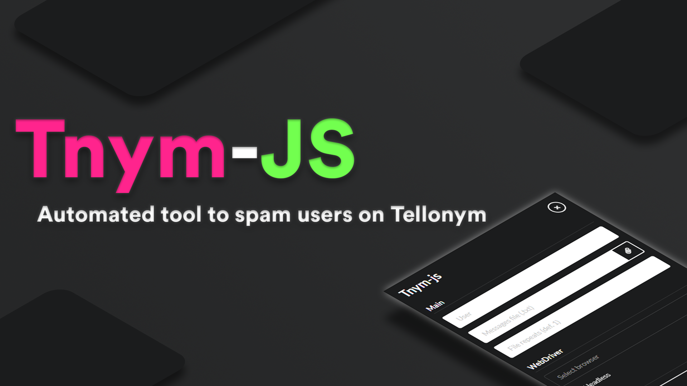

# Tnym-js



Tnym-js is an automated tool to spam users on the noted website [Tellonym](https://tellonym.me/).

## Features

- A very fast spammer.
- Captcha bypass on message sending.
- Easy interface to use.
- Nothing external needed to install.

**A known and big problem is how large the program is because of Electron. If you are a dev and know how to fix this, please feel free to do a PR.**

## Downloads

- Windows | [Portable x64](https://github.com/FedeIlLeone/Tnym-js/releases/latest/download/Tnym-js-x64.zip)
- Windows | [Portable x86](https://github.com/FedeIlLeone/Tnym-js/releases/latest/download/Tnym-js-x86.zip)

## Installation

The project is made in JavaScript and Electron for the GUI.

The only requirement to use the tool is to have Chrome, Firefox or Microsoft Edge on your PC. Having the latest versions of the selected browser is highly recommended. Also, WebDrivers are already packed with the tool, there's no need to download them.

## Building and Scripts

If you would like to build the project by yourself, there are scripts ready out of the box.

**Build for Distribution:**
```shell
$ npm run build
```
**Build for Development:**
```shell
$ npm install
$ npm run dev
```
**Run:**
```shell
$ npm run start
```