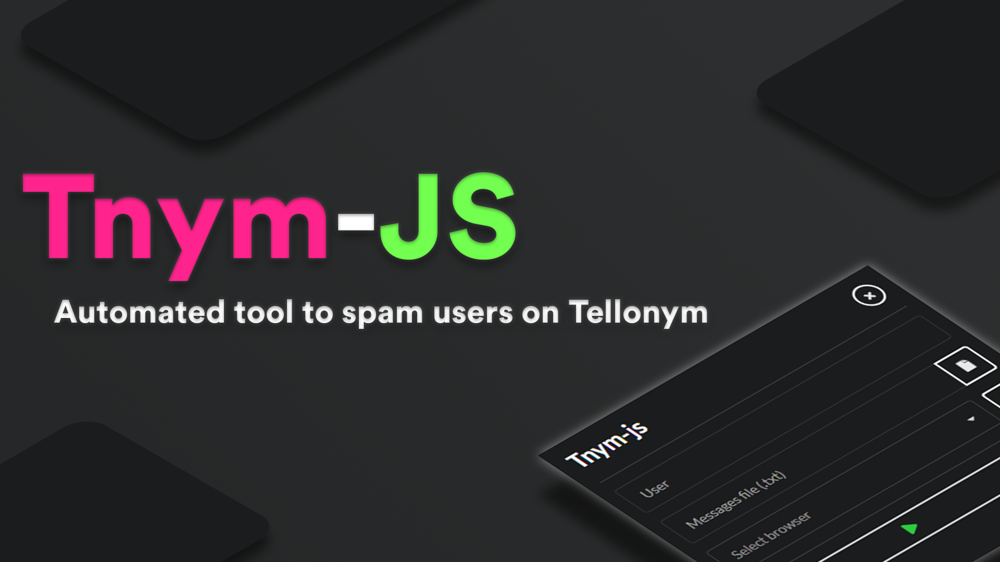

# Tnym-js



Tnym-js is an automated tool to spam users on the noted website [Tellonym](https://tellonym.me/).

## Downloads

- Windows | [Portable x64](https://github.com/FedeIlLeone/Tnym-js/releases/latest/download/Tnym-js-x64.zip)
- Windows | [Portable x86](https://github.com/FedeIlLeone/Tnym-js/releases/latest/download/Tnym-js-x86.zip)

## Installation

The project is made in JavaScript and Electron for the GUI.

The only requirement to use the tool is to have [Chrome](https://chromedriver.chromium.org/), [Firefox](https://github.com/mozilla/geckodriver/releases/) or [Microsoft Edge](https://developer.microsoft.com/en-us/microsoft-edge/tools/webdriver/) as the WebDriver. **Remember to add the driver in $PATH.**

## Building and Scripts

If you would like to build the project by yourself, there are scripts out of the box.

**Build for Distribution:**
```shell
$ npm run build
```
**Build for Development:**
```shell
$ npm install
$ npm run dev
```
**Run:**
```shell
$ npm run start
```